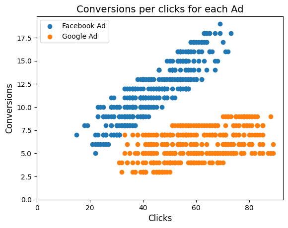

# A/B Test: Facebook Ads vs. Google Ads Conversion Performance
========================

## Project Overview

This project analyzes a sample dataset of digital ad campaign performance to compare the effectiveness of Facebook Ads (Meta Ads) against Google Ads (AdWords Ads) in driving conversions. The primary objective is to determine if the Facebook Ad campaign is more effective in terms of conversions compared to the Google Ad campaign, utilizing an A/B testing methodology.

## Research Context & Methodology

* **Research Objective:** To determine if the Facebook Ad campaign is more effective in terms of conversions compared to the Google Ad campaign, utilizing an A/B testing methodology.
* **Research Context:** Consumer behavior
* **Nature of Research Enquiry:** Exploratory and Descriptive
* **Status of Data Source:** Primary
* **Type of Data:** Quantitative
* **Mode of Data Collection:** Continuous
* **Method of Data Collection:** Online
* **Research Design:** Longitudinal

## Skills Demonstrated

* Data Cleaning
* A/B Testing Concepts
* Statistical Analysis
* Data Visualization
* Reporting

## Data Source

The dataset used in this project is a sample from the Capstone Project of the "[Meta Marketing Analytics Professional Certificate](https://www.coursera.org/professional-certificates/facebook-marketing-analytics)" on [Coursera](https://www.coursera.org/). This dataset was provided for educational purposes within the course.

## Deliverables

* **Analysis Notebook:** A Jupyter Notebook detailing the data cleaning, exploratory data analysis, A/B testing implementation, statistical analysis, and interim findings.
* **Summary Report:** A concise report summarizing the key findings, conclusions, and recommendations based on the A/B test results (available in [PDF](http://reports/summary.pdf) format).

## Key Findings

Our analysis revealed a significant difference in conversion rates between the two advertising platforms, with Facebook showing an approximate **16% lead** over Google for this dataset. Statistical analysis (t-test) confirmed that Facebook was indeed more effective at driving conversions for this particular campaign.

|  | 
|:--:| 
| *A scatter plot showing the relationship between ad clicks and conversions* |

---

## Technologies Used

| Tool/Library | Purpose                                                   |
| :----------- | :-------------------------------------------------------- |
| Python       | General-purpose programming language                      |
| NumPy        | Numerical computing with arrays and matrices              |
| Pandas       | Data manipulation and analysis                            |
| SciPy        | Scientific computing, including statistical functions     |
| Matplotlib   | Data visualization for charts and graphs                  |
